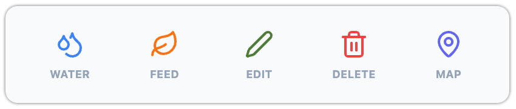
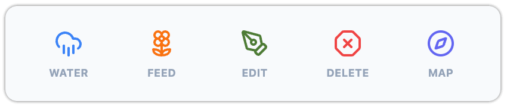
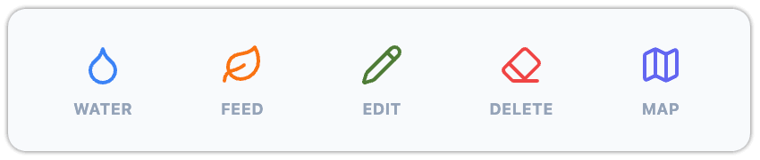
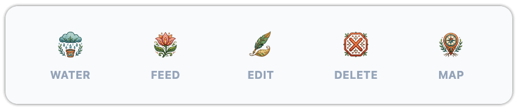
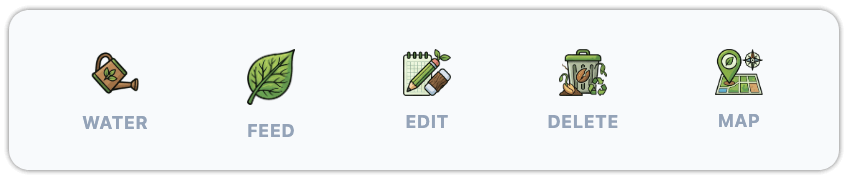
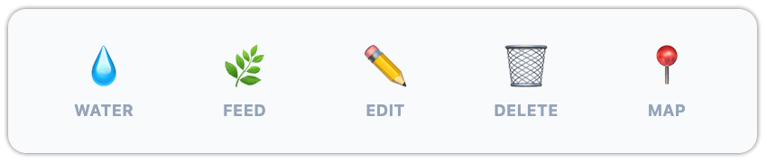

# FloraSync 🌿

FloraSync is a mobile-first, offline-ready local web application designed to eliminate data-entry friction in home greenhouse and raised garden bed management. By deploying weatherproof physical QR codes directly onto plant stakes, shelves, and garden beds, users can instantly log critical care metrics (watering, feeding) or register new plants with a single tap or scan.

The application is powered by a React frontend and a robust Node.js/SQLite local backend, ensuring complete data ownership and rapid local-network synchronization.

---

## 🌿 Features & App Structure

FloraSync is designed to handle everything from individual houseplant care to massive, multi-zone garden tracking. The application is divided into several core modules:

### 🏡 The Garden
The core management suite where you track your physical spaces and the plants within them.
* **Inventory Manager:** Track individual plant instances. Monitor hydration levels, feeding schedules, growth stages, and milestones (like blooming or harvesting).
* **Zone Manager:** Manage macro-areas (e.g., "Greenhouse", "Backyard Beds"). Zones can have specific environmental modifiers, like custom evaporation rates or rain cover flags, which automatically adjust the care schedules for the plants inside them.
* **Location Manager:** Micro-manage specific spots within your zones (e.g., "Shelf B", "North Corner") to keep your inventory perfectly organized.
* **Master Journal:** A centralized, event-sourced timeline. FloraSync uses a "Trickle-Down" architecture—when you water an entire Zone, that event is recorded once at the Zone level and dynamically cascades down to every plant's individual history feed.

**Inventory & Plant Tracking (`InventoryManager.tsx` & `PlantDetail.tsx`):**
The Inventory Manager is the heart of your active garden tracking, displaying all living plants currently deployed in your physical spaces.
* **Smart Grouping & Search:** By default, plants are grouped by their Archetype Category, but can be dynamically re-grouped by Macro Zone or Specific Location. A live search bar auto-expands relevant groups to quickly locate specific plants.
* **Dynamic Hydration Math:** Each plant calculates a real-time hydration ratio. It takes the archetype's base watering interval, modifies it by the plant's sun requirement (e.g., "Full Sun" dries out 20% faster, "Shade" dries out 20% slower), and finally applies the parent Zone's custom evaporation modifier.
* **Plant Detail Profiles:** Tapping a plant card or scanning its QR code opens a comprehensive profile that aggregates:
  * **Vitality Status:** Visual badges indicating if a plant is optimally hydrated, overdue for care, or marked as "Unmonitored / Rain-Fed" (which gracefully excludes established shrubs or trees from your daily watering queues).
  * **Milestone Tracking:** Automatically estimates upcoming bloom or harvest dates based on the planting date. For perennials and biennials, it smartly rolls the anniversary forward each year!
  * **Cultivation Inheritance:** Intelligently displays care basics, traits, and lifecycle instructions inherited directly from the global Plant Dictionary.
  * **Quick Actions & Plugins:** One-tap buttons for logging water/feed events, alongside dynamically injected action buttons provided by any installed Addon Plugins.
  * **Trickle-Down Journal:** A consolidated history feed showing specific plant observations seamlessly merged with inherited macro-events (like Zone watering or whole-garden rain).

**Spaces & Ecosystems (`ZoneManager.tsx` & `LocationManager.tsx`):**
FloraSync uses a strict relational hierarchy (Zone ➔ Location ➔ Plant) to keep your garden organized and to automate environmental care calculations.
* **Macro Zones:** Represent large physical areas like a "Greenhouse" or "Front Porch". 
  * **Environmental Modifiers:** You can assign custom evaporation modifiers (e.g., 1.5x for a hot, windy patio, or 0.5x for a humid, shaded indoor greenhouse) which dynamically speed up or slow down the watering schedules for every plant inside it.
  * **Covered Areas:** Zones can be flagged as "Covered (No Natural Rain)" to signify areas excluded from natural weather events.
* **Micro Locations:** Specific shelves, beds, or rows within a Zone (e.g., "Top Shelf", "South Bed"). This allows you to pinpoint exactly where a specific pot lives.
  * **Smart Grouping:** In the manager view, locations are automatically grouped and sorted by their parent Zone using collapsible accordions, ensuring organized navigation even in massive gardens.
  * **Location Profiles:** Tapping a location reveals a dedicated dashboard featuring a customizable cover photo, a live summary of all active plants assigned to that spot, and a localized Trickle-Down journal feed.
  * **Action Pinning:** Users can pin specific batch actions to the top of the location profile, giving them one-tap access to routine maintenance for that specific shelf or bed.
* **Zero-Click Batch Actions:** Scanning a Zone or Location QR code allows you to execute batch actions (like "Water All" or "Feed All") for dozens of plants instantly. Thanks to the Trickle-Down architecture, this writes a single clean journal entry to the parent space instead of spamming individual plant histories.
* **Just-In-Time Registration:** If you scan a brand new, unassigned QR code and choose to register it as a Location or Zone, the app provides a seamless onboarding form to name it and link it into your hierarchy on the spot.

**Unified Trickle-Down Journal System (`SharedJournalFeed.tsx` & `SharedJournalForm.tsx`):**
FloraSync features a powerful, context-aware journal engine that tracks care history and observations without duplicating data or bloating the database.
* **Omni-Level Logging:** You can attach rich notes, photos, and activities (like pruning, harvesting, or pest sightings) to any entity level: the Global Garden, a Macro Zone, a Micro Location, or a Specific Plant Instance.
* **The Trickle-Down Engine:** The journal operates on a seamless inheritance model. If you execute a macro event like "Water Greenhouse" or log "Heavy Rain" at the global level, the database creates *exactly one* journal entry at that parent level. When you view a specific plant inside that greenhouse, its personal timeline dynamically pulls in and displays that parent event as an "Inherited Event" without actually copying the data.
* **Context-Aware Feeds:** The UI intelligently adapts based on where you are viewing it. In the Global Master Journal, it aggregates every event across your entire garden into a single, filterable timeline. On a specific plant profile, it displays a focused timeline and restricts editing/deleting to local events, keeping macro-events safely locked to their parent source.
* **Routine Care Toggles:** Users can easily toggle "Show Routine Care" on or off in any feed to filter out the noise of daily watering and feeding, allowing them to focus purely on major milestones, observations, and photos.

### 📖 Plant Dictionary
A centralized database of "Plant Archetypes" (species or varieties) that is **global across all workspaces and gardens**. Instead of entering data for every single tomato plant, you define the "Heirloom Tomato" archetype once, and your individual physical plants inherit these rules.

**Administration & Maintenance:**
Because the dictionary acts as the global source of truth, only Garden Owners and Admins have permission to add or update archetypes. They can manually create entries via the UI or use bulk import tools (documentation pending) to quickly populate the database.

**Archetype Details:**
To provide the best guidance for physical plants, a new archetype entry gathers extensive cultivation data, including:
* **Basic Info:** Common Name, Scientific Name, Category, Lifecycle, Growth Habit.
* **Care Routines:** Sun Requirements, Watering Intervals, Feeding Intervals, What to Feed, Pruning Tips, Growth Requirements.
* **Harvest & Yield:** Days to Harvest, Flavor Profile, Uses for Large Harvests.
* **Planting & Environment:** When to Plant, When to Harvest, Planting Instructions, Hardiness Zones, Hardiness Notes.
* **Ecosystem:** Companion Plants, Combative Plants.
* **Extras:** Fun Facts and Image Thumbnails.

**Organization & Safety:**
The dictionary features a dynamic search and categorization engine. As you type in the search bar, the UI automatically groups and expands relevant plant categories. To prevent data corruption and orphaned records, FloraSync includes a strict relational safety lock: an Archetype cannot be deleted if there are any living `PlantInstance`s currently using it in your garden.

**Archetype Detail View (`ArchetypeDetail.tsx`):**
The detail screen operates in two distinct modes based on user permissions and context:
* **View Mode:** Presents a highly visual, read-only summary of the archetype. Information is intelligently grouped into collapsible accordion sections (Cultivation Basics, Details & Traits, Lifecycle & Harvest, and Fun Facts). The UI uses smart validation to dynamically hide any empty fields or arrays, ensuring a clean interface without blank gaps. Helpful visual cues, like dynamic icons that change based on sun, water, and feeding requirements, provide at-a-glance care summaries.
* **Edit/New Mode:** Authorized Admins can toggle into edit mode (handled via the `ArchetypeForm`) to update the archetype's comprehensive data points. When creating a new archetype, the system automatically generates a unique identifier from the common name and prevents duplicate entries.

**Rich Media & Trivia (`FunFactManager.tsx`):**
To make the dictionary engaging and educational, the system includes a dedicated inline manager for creating rich "Fun Facts" or trivia about a plant. During archetype editing, this manager allows admins to:
* Add multiple trivia items, seamlessly converting legacy string-only facts into rich objects behind the scenes.
* Expand specific facts inline to edit them without leaving the context of the main form.
* Assign specific context icons from a predefined list (e.g., "Bugs", "Food", "Dangerous", "Science") to visually categorize the trivia.
* Upload custom thumbnail images that override the default icons.
* Add custom titles and source attributions to specific facts.
* View a real-time layout preview of how the fact will look to end-users on the detail screen.

### 🖨️ Print Center (Admin)
The Print Center is the bridge between your digital database and the physical garden. It generates perfectly spaced, ready-to-print sheets of QR codes for your plants, locations, and zones. 

**Print Generation Modes:**
* **The Print Queue:** As you navigate your garden within the app, you can selectively add individual plants, zones, or locations to your Print Queue directly from their respective detail screens. This is perfect for replacing a damaged tag or printing a label for a single new cutting. The Print Center features a **Smart Fill** option, which automatically generates sequential blank tags to fill any remaining empty spaces on your sticker paper, ensuring zero waste!
* **Bulk from DB:** Instantly generate a comprehensive sheet of QR codes for every active plant, location, or zone currently registered in your database.
* **Blank Sequences:** Generate sheets of unassigned, sequentially numbered blank tags (e.g., `TAG-001`, `TAG-002`). You can stick these blank tags onto empty pots or garden beds immediately. When you finally plant something there, scanning the blank tag opens a dynamic onboarding flow to register the plant on the spot.

**Label Formats & Zero-Click Actions:**
The Print Center supports multiple physical templates out of the box:
* 10x6cm Large Garden Stakes
* 6x3cm Medium Labels
* 1-inch Square Micro-Stickers

Crucially, you can embed "Zero-Click" actions directly into these printed QR codes. For example, you can print a standard "Info" tag for a Zone, alongside a specific "Water Zone" tag. Scanning the latter instantly processes the watering action for every plant in that zone without requiring a single tap on the screen.

### ⚙️ System & Customization

**The Command Center (Dashboard & Widgets):**
The Dashboard is a dynamic sorting engine that builds an "Attention Queue" to surface the most urgent tasks and relevant insights using a modular widget system.
* **The Attention Queue Logic:** FloraSync doesn't just show you a static list of plants. It calculates a real-time hydration and nutrition ratio for every plant by comparing its last care timestamp against its specific archetype intervals (intelligently modified by Zone evaporation rates and Sun Exposure). Plants whose ratios hit 0% (overdue) are automatically floated to the top of your queues.
* **Garden Vitality:** A high-level summary showing the overall hydration and nutrition percentages of your entire tracked garden, along with active plant counts.
* **Quick Actions:** A horizontal scroll of one-tap actions. Includes global batch actions ("Water All"), environmental logging ("Log Rain"), and any specific batch actions you've pinned from Location, Zone, or Plant profiles.
* **Urgent Location Care:** Groups extremely thirsty plants by their physical location, offering a single button to "Water all on Shelf A" instead of tapping individually.
* **Needs Watering & Hungry Plants:** Distinct queues displaying individual plants that are overdue for water or fertilizer, complete with what specific food they need.
* **Health Watchlist:** Pulls data directly from your Plant Journals. If a recent journal entry flags a health issue (e.g., "Aphids"), the plant is pinned here until a new journal entry marks it as "Resolved" or "Healthy".
* **Approaching Harvest:** Scans the planting dates and lifecycle data of active crops to count down the days until they are ready to pick.
* **The Nursery:** Highlights seedlings and fresh transplants planted within the last 14 days so you can keep a close eye on their delicate establishment phase.
* **Random Spotlight:** A rotating trivia card that generates smart tips (e.g., pruning reminders, companion planting warnings) or global Fun Facts based on the exact plants currently growing in your garden.
* **Garden Pulse:** A localized social feed showing the 5 most recent actions taken across your garden by any collaborator.
* **Local Weather & Soil Insights (Opt-In Addon):** While FloraSync is built to be a fully local, offline-first application, it includes an official "Weather Widget" addon. Because this widget requires an active internet connection to fetch live data, it is intentionally deactivated by default to respect your privacy and local network preferences. Once activated by a Garden Owner or Admin, it uses the **Open-Meteo** API to provide hyper-local weather conditions, soil temperatures, evapotranspiration (water loss) rates, and impending storm alerts—translating raw meteorological data into actionable gardening advice right on your dashboard.
* **Customization:** Users can reorder or completely hide any of these widgets to tailor the dashboard to their specific workflow. Layout preferences sync to the individual user profile, so your layout won't affect your collaborators.

**Settings & Administration (`SettingsManager.tsx`):**
The General Settings screen serves as the control center for your account and garden workspace. It dynamically renders sections based on your role and permissions:
* **Garden Profile:** Update the workspace name and cover photo for the active garden.
* **Account Info:** Manage your personal details, email, and active session.
* **User Administration:** Authorized admins can manage system users, assign workspace roles (e.g., viewer, admin), and control access permissions.
* **Data Import & Optimization:** Access powerful tools to manage your database payload and bulk-import new dictionary archetypes.
  * **Plant Package Import:** FloraSync supports uploading a `.zip` package containing a JSON array of plant archetypes alongside their local image files. The system automatically reads the JSON, matches the `imageUrl` paths to the files inside the zip, converts them into compressed data, and safely merges them into your global dictionary.
    * **Zip File Structure Example:**
      ```text
      /new-plants.json
      /images/vegetables/spaghetti-squash.jpg
      ```
    * **JSON Payload Example (`new-plants.json`):**
      ```json
      [
        {
          "id": "spaghetti-squash",
          "commonName": "Spaghetti Squash",
          "category": "Vegetable",
          "lifecycle": "Annual",
          "sunRequirement": "Full Sun",
          "waterIntervalDays": 3,
          "imageUrl": "images/vegetables/spaghetti-squash.jpg"
          ...
        }
      ]
      ```
  * **Database Optimization:** A one-click utility that safely scans your entire database (plants, journals, locations, and zones) and permanently compresses any oversized photos, drastically speeding up your local network syncs.
* **Sandbox Management:** A special, restricted tool for "God-Admins" to instantly wipe and restore the Demo Garden to its initial seed state.

**Appearance & Theming:**
FloraSync offers a highly customizable, mobile-first interface designed to look beautiful in any environment. Because these settings are tied to your specific user profile, changing them won't affect what your collaborators see!
* **🌙 Display Mode (Light / Dark):** Fully supports OS-level dark mode syncing via **System Default**, or manual overrides (Light/Dark). This ensures the app is easy to read whether you are in a glaringly bright greenhouse or doing night-time garden checks.
* **🖌️ Color Themes:** Personalize your workspace with a variety of beautiful, garden-inspired color palettes. This updates primary buttons, navigation accents, and active states. *Note: New custom color themes can also be added dynamically via Plugins!*
* **🎭 Icon Styles:** Completely change the iconography system used throughout the app to match your garden's vibe. This instantly updates the look of the water, feed, edit, delete, and map icons everywhere:
  * **Standard (Default):** Bold & direct.  
    
  * **Elegant:** Thin & refined line-art.  
    
  * **Minimalist:** Clean & simple modern icons.  
    
  * **Boho Nature:** A fun, hand-drawn aesthetic.  
    
  * **Science:** Analytical and precise styling.  
    
  * **Emoji:** Fun, colorful, native OS emojis.  
    

**Addon / Plugin System (`AddonManager.tsx` & `server/routes/addons.js`):**
FloraSync features a robust, secure plugin architecture allowing developers to seamlessly extend the app's functionality with custom code, external API integrations, and new UI elements.
* **Plugin Capabilities:** Plugins can inject custom Action Buttons directly into plant profiles, append new Activity Types to the Master Journal, provide custom settings forms, and execute custom backend JavaScript.
* **Role-Based Permissions:**
  * **System Admin ("God-Admin"):** Has exclusive rights to upload new `.zip` plugin packages and permanently delete or uninstall them from the server disk.
  * **Workspace Owners:** Can activate or deactivate installed plugins for their specific garden, and configure the plugin's custom settings.
  * **Helpers & Viewers:** Can view which plugins are active on the server but cannot modify their states.
* **Package Structure:** A plugin is distributed as a `.zip` file. The backend intelligently handles the extraction, but it strictly requires a `manifest.json` file.
  * **Manifest Requirements:** Must include `id`, `name`, `version`, and an `uninstallScript` (to safely clean up the database if the plugin is ever removed).
  * **Optional Hooks:** Can include an `installScript` (runs immediately upon upload), an `executeScript` (handles backend API calls triggered by custom UI buttons), and a `settingsSchema` (which automatically generates a clean settings form in the UI).
* **Installation & Activation Lifecycle:**
  1. **Upload:** A God-Admin uploads the `.zip`. The system validates the manifest, extracts the files to `src/data/plugins/`, and runs the `installScript` to prepare any required database tables.
  2. **Activate:** An Owner clicks "Activate", making the plugin's UI hooks (like journal types or buttons) visible across their workspace.
  3. **Configure:** Owners can open the dynamically generated settings modal to configure API keys, coordinates, or preferences defined by the plugin's schema.
  4. **Execute:** Users interact with the plugin in the UI, which routes secure requests to the backend `execute.js` script.
